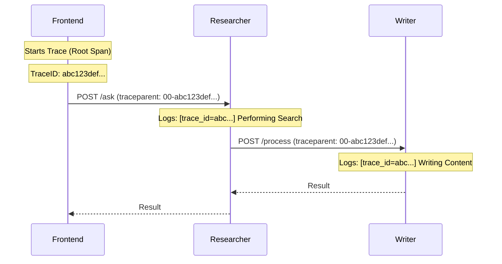

# Design Document: Standardized Distributed Tracing (OTEL)

## 1. Goal
To implement standardized distributed tracing across the AI Agent Mesh using OpenTelemetry (OTEL) protocols. This ensures that every request can be tracked across service boundaries using industry-standard W3C Trace Context, making the mesh observable and ready for enterprise-grade monitoring (Jaeger, Langfuse, Honeycomb) without re-engineering.

## 2. The Shift: From Custom to Standard
Instead of a bespoke `X-Correlation-ID`, we will adopt **OpenTelemetry (OTEL)**.
*   **Protocol**: W3C Trace Context (standardized `traceparent` headers).
*   **Library**: `opentelemetry-python` SDK.
*   **Advantage**: Future-proof. Any standard observability tool can parse our headers.

## 3. High-Level Concept: The "Professional Middle Ground"
We will implement the "Auto-Instrumentation" pattern but keep the telemetry **in-process** for now.
1.  **Trace Propagation**: Use the `traceparent` header to pass identity.
2.  **Context Tracking**: Use the OTEL `Context` API (replaces manual `contextvars`).
3.  **Logging**: Inject the `trace_id` and `span_id` into every log line via a custom logging formatter.
4.  **No Backend (Yet)**: Telemetry is exported to the **Console/Logs**, not an external database.

## 4. Architecture Diagram

## 5. Technical Implementation Plan

### A. Dependency Update
Add OpenTelemetry libraries to `requirements.txt`:
*   `opentelemetry-api`
*   `opentelemetry-sdk`
*   `opentelemetry-instrumentation-aiohttp-client`
*   `opentelemetry-instrumentation-aiohttp-server`

### B. Unified Tracing Utility (`src/common/tracing.py`)
Create a helper to initialize the OTEL SDK:
*   Configure a `ConsoleSpanExporter` to print spans to stdout.
*   Create a `get_tracer()` function.
*   Set up the **Global Tracer Provider**.

### C. Logging Enrichment
Update `src/common/logging.py` (to be created) to use an OTEL-aware formatter:
*   Standard format: `%(asctime)s [%(levelname)s] [trace_id=%(trace_id)s] [%(name)s] %(message)s`
*   Automatically pulls `trace_id` from the active OTEL span.

### D. Middleware Integration (`AgentServer`)
Update `src/common/server.py`:
1.  Use `aiohttp_server` instrumentation to automatically catch incoming trace context from requests.
2.  Ensure that the server's identity logic (SPIFFE) is wrapped inside an active span.

### E. Client-Side Forwarding
Update `src/frontend/app.py` and `src/agents/researcher.py`:
1.  Use `aiohttp_client` instrumentation to automatically inject the `traceparent` header into outgoing requests.
2.  This ensures zero-touch propagation of the trace context.

## 7. UI Demonstration: The Security Dashboard
The Frontend UI (Streamlit) includes a **Security Inspector** that displays:
*   **Trace ID**: The active correlation ID for the user's session.
*   **Propagation Status**: Verification that headers are moving through the mesh.

---
**Status**: ✅ IMPLEMENTED
**Target**: Phase 3
