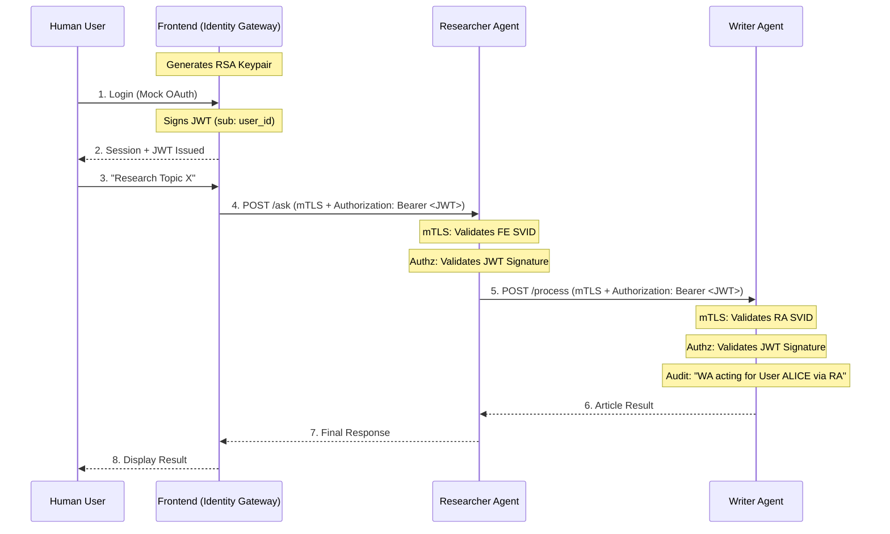

# Design Document: User-Contextual Authorization & Propagation

## 1. Goal
To implement a secure mechanism for propagating human user identity ("Context") through the AI Agent Mesh. This ensures that every action taken by an agent (Researcher, Writer) is cryptographically linked to a specific authenticated user, preventing unauthorized "agent-only" actions and providing a clear audit trail.

## 2. The Problem: "The Anonymous Mesh"
In the current Phase 2 implementation:
1.  **Machine Identity (SPIFFE)** is strong. We know *which* service is calling.
2.  **User Identity** is weak. We only pass a string `user_id` in the JSON body.
3.  **Vulnerability**: A compromised Agent (e.g., Researcher) could spoof the `user_id` to the Writer, or trigger actions without any user involvement at all.

## 3. High-Level Concept: Hybrid Identity
We will combine **SPIFFE (Machine Identity)** with **OIDC-style JWTs (Human Identity)**. 

*   **SPIFFE (mTLS)**: Secures the "Pipe" (Transport layer).
*   **JWT (Bearer Token)**: Secures the "Context" (Application layer).

## 4. Architecture Diagram

## 5. Technical Components

### A. JWT Structure
The Frontend will issue a signed JWT with the following claims:
*   `iss`: `frontend.mesh.local` (Token Issuer)
*   `sub`: `alice@example.org` (Subject/User)
*   `aud`: `ai-agent-mesh` (Audience)
*   `iat`: Issued At time
*   `exp`: Expiration (e.g., 1 hour)
*   `scope`: `mesh:all` (Specific permissions)

### B. Public Key Distribution (Sidecar Metadata Server)
To verify the JWT without a central database, Agents need the Frontend's **Public Key**. 
*   **Architecture**: Because Streamlit (Frontend UI) is a reactive framework, a persistent Metadata Server runs as a **Sidecar process** within the Frontend container.
*   **Implementation**: This sidecar exposes a dedicated port (`8080`) secured by **SPIFFE mTLS**. It provides the `GET /debug/jwks` endpoint.
*   **Key Sharing**: Both the Frontend UI and the Metadata Sidecar share a filesystem volume (e.g., `/tmp`) where the Mesh RSA keys are stored.
*   **Discovery**: Agents fetch and cache the Public Key (JWKS) from the Metadata Server at startup.

### C. AgentServer Decorator (`@require_user_context`)
A new decorator in `server.py` that wraps a handler:
1.  Calls `require_identity` (verifies SPIFFE SVID).
2.  Extracts `Authorization: Bearer <token>` from headers.
3.  Verifies the JWT signature using the cached JWKS.
4.  If valid, stores user info in `request['user_context']`.

## 6. Security Analysis (Zero Trust)
*   **Defense in Depth**: Even if mTLS is bypassed (unlikely), the JWT is required for any meaningful action.
*   **Non-Repudiation**: The Writer can prove the request originated from a specific user because only the Frontend (the trusted gateway) can sign tokens for that user.
*   **Least Privilege**: We can eventually add scopes (e.g., `research:read`, `writer:admin`) to the JWT to restrict what the user is allowed to trigger in the mesh.

### E. UI Visualization
The **Security Dashboard** in the Frontend provides real-time verification of the User Context:
*   **JWT Decoder**: Shows the decoded claims (`sub`, `email`, `iat`) representing the human identity.
*   **Identity Pinning**: Links the human identity to the machine identity (SVID) and the active trace.

## 7. Development Roadmap
1.  **Library Update**: Added `authlib`. ✅
2.  **Frontend Update**: Implemented Key Generation and `/jwks` sidecar. ✅
3.  **Common Logic**: Added `JWTManager` and `@require_user_context`. ✅
4.  **Agent Integration**: Applied decorators to endpoints. ✅
5.  **Propagation**: Researcher forwards `Authorization` header. ✅

---
**Status**: ✅ IMPLEMENTED
**Target**: Phase 3
