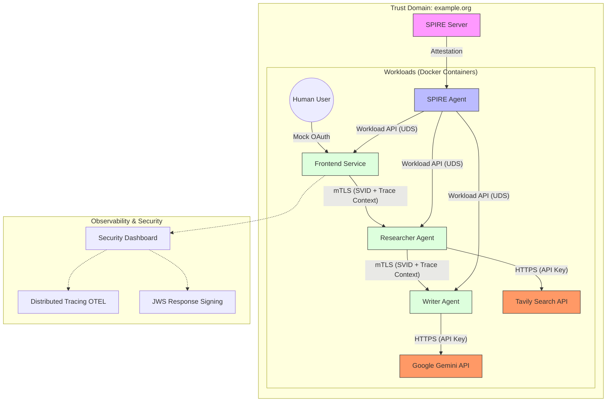

# System Architecture: SPIFFE-Authenticated AI Agents

## Overview
This system demonstrates a Zero Trust architecture for AI Agents using **SPIFFE** (Secure Production Identity Framework for Everyone) and **SPIRE** (SPIFFE Runtime Environment).

The application consists of independent AI Agents (Microservices) that collaborate to perform tasks. Unlike traditional API Key architectures for internal communication, these agents authenticate each other using **Cryptographic Identities (SVIDs)** provided by SPIRE, ensuring that only authorized services can communicate.

## Architecture Diagram

## Key Components

### 1. SPIRE Infrastructure
*   **SPIRE Server**: The Certificate Authority (CA) for the Trust Domain `example.org`. It manages registration entries and signs SVIDs.
*   **SPIRE Agent**: Runs on the node. It attests the workloads (containers) and exposes the **SPIFFE Workload API** via a Unix Domain Socket (UDS).

### 2. Identities & Workload Attestation
We utilize the **SPIRE Docker Workload Attestor** to verify container identities. The SPIRE Agent inspects the calling process and queries the Docker Daemon to validate labels.

**Verification Selectors:**
Registration entries compel the workload to match:
1.  **Project Label**: `docker:label:com.docker.compose.project=spiffe-spire-demo`
2.  **Service Label**: `docker:label:com.docker.compose.service=<service-name>`

**Identity Mapping:**

| Service | Docker Service Label | SPIFFE ID |
| :--- | :--- | :--- |
| **Frontend** | `frontend` | `spiffe://example.org/ns/ui/sa/frontend` |
| **Researcher** | `researcher` | `spiffe://example.org/ns/agents/sa/researcher` |
| **Writer** | `writer` | `spiffe://example.org/ns/agents/sa/writer` |

**Trust Policy**:
*   **Researcher**: Authorized to be called by `frontend`.
*   **Writer**: Authorized to be called by `researcher` and `frontend`.

### 3. A2A Communication (The Secure Mesh)
Communication between agents is secured via:
1.  **Transport Security (mTLS)**: Mutual authentication using SPIFFE SVIDs.
2.  **Authorization**: Strict validation of the caller's SPIFFE ID via the `@require_identity` decorator.
3.  **Observability (OTEL)**: Automatic propagation of **W3C TraceContext** headers via OpenTelemetry, linking requests across the mesh.
4.  **Content Integrity (Response Signing)**: Agents sign their responses using their SVID private keys (**JWS**). The Frontend validates these signatures to ensure AI output hasn't been tampered with in transit.

### 4. Human Authentication & The Trusted Boundary
The **Frontend App** acts as the **Security Gateway** between the Human world and the Machine/SPIFFE world.

**Coexistence Strategy (OAuth + SPIFFE):**
*   **OAuth 2.0 (Mock)**: Authenticates the **Human** to the Frontend.
*   **SPIFFE**: Authenticates the **Frontend** to the Backend Agents.
*   **Identity Propagation**: The Frontend includes user metadata in the JSON payload. Agents trust this assertion because they trust the Frontend's SVID.

### 5. Frontend & Security Dashboard
The **Frontend App** acts as the **Security Gateway** and provides a real-time **Security Inspector** for deep mesh observability.

**Key Features:**
*   **Machine Identity**: Shows the verified SPIFFE ID of the frontend.
*   **Human Identity**: Decodes the RSA-256 signed JWT used for user context.
*   **Distributed Tracing**: Displays the active `trace_id` propagated across agents.
*   **Content Integrity**: Validates the cryptographic signatures of the Researcher and Writer agents.

### 7. Attack Simulation & Verification
A dedicated attack script (`src/attack_simulation.py`) runs inside the mesh to prove the efficacy of the Zero Trust controls. It attempts:
1.  **Identity Stripping**: Using a valid SVID but removing the User JWT (Result: `401`).
2.  **Impersonation**: Signing a JWT with an untrusted private key (Result: `401`).

### 6. Technology Stack
*   **Language**: Python 3.11
*   **Web Framework**: `aiohttp` (Server & Client), `Streamlit` (UI)
*   **Observability**: OpenTelemetry SDKs (Auto-instrumented)
*   **Security**: SPIFFE/SPIRE, JSON Web Signature (JWS), JWT
*   **AI Models**: Gemini 2.0 Flash, Tavily Search
