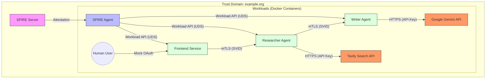

# System Architecture: SPIFFE-Authenticated AI Agents

## Overview
This system demonstrates a Zero Trust architecture for AI Agents using **SPIFFE** (Secure Production Identity Framework for Everyone) and **SPIRE** (SPIFFE Runtime Environment).

The application consists of independent AI Agents (Microservices) that collaborate to perform tasks. Unlike traditional API Key architectures for internal communication, these agents authenticate each other using **Cryptographic Identities (SVIDs)** provided by SPIRE, ensuring that only authorized services can communicate.

## Architecture Diagram

## Key Components

### 1. SPIRE Infrastructure
*   **SPIRE Server**: The Certificate Authority (CA) for the Trust Domain `example.org`. It manages registration entries and signs SVIDs.
*   **SPIRE Agent**: Runs on the node. It attests the workloads (containers) and exposes the **SPIFFE Workload API** via a Unix Domain Socket (UDS).

### 2. Identities & Workload Attestation
We utilize the **SPIRE Docker Workload Attestor** to verify container identities. The SPIRE Agent inspects the calling process and queries the Docker Daemon to validate labels.

**Verification Selectors:**
Registration entries compel the workload to match:
1.  **Project Label**: `docker:label:com.docker.compose.project=spiffe-spire-demo`
2.  **Service Label**: `docker:label:com.docker.compose.service=<service-name>`

**Identity Mapping:**

| Service | Docker Service Label | SPIFFE ID |
| :--- | :--- | :--- |
| **Frontend** | `frontend` | `spiffe://example.org/ns/ui/sa/frontend` |
| **Researcher** | `researcher` | `spiffe://example.org/ns/agents/sa/researcher` |
| **Writer** | `writer` | `spiffe://example.org/ns/agents/sa/writer` |

**Trust Policy**:
*   **Researcher**: Authorized to be called by `frontend`.
*   **Writer**: Authorized to be called by `researcher`.

### 3. Authentication & Communication Flow (A2A over mTLS)
1.  **Workload Startup**: When a container starts, it fetches its SVID from the SPIRE Agent.
2.  **Communication**: Services use `aiohttp` with a custom SSL context derived from their SVID.
3.  **Transport Security (mTLS)**:
    *   **Mutual Auth**: The server requests the client's certificate. The client presents its SVID.
    *   Each side validates the other's SVID against the Trust Domain bundle.
4.  **Authorization**:
    *   The `AgentServer` decorator `@require_identity` checks the SPIFFE ID of the caller.
    *   If the ID is not in `ALLOWED_CALLERS`, the request is rejected with a 403.

### 4. Human Authentication & The Trusted Boundary
The **Frontend App** acts as the **Security Gateway** between the Human world and the Machine/SPIFFE world.

**Coexistence Strategy (OAuth + SPIFFE):**
*   **OAuth 2.0 (Mock)**: Authenticates the **Human** to the Frontend.
*   **SPIFFE**: Authenticates the **Frontend** to the Backend Agents.
*   **Identity Propagation**: The Frontend includes user metadata in the JSON payload. Agents trust this assertion because they trust the Frontend's SVID.

### 5. Technology Stack
*   **Language**: Python 3.10+
*   **Web Framework**: `aiohttp` (Async Server & Client)
*   **AI Models**: 
    *   **Gemini 2.0 Flash**: Content generation (direct REST API).
    *   **Tavily**: Real-time web search.
*   **Identity**: SPIFFE/SPIRE (via custom gRPC Workload API client).
*   **Infrastructure**: Docker & Docker Compose.
